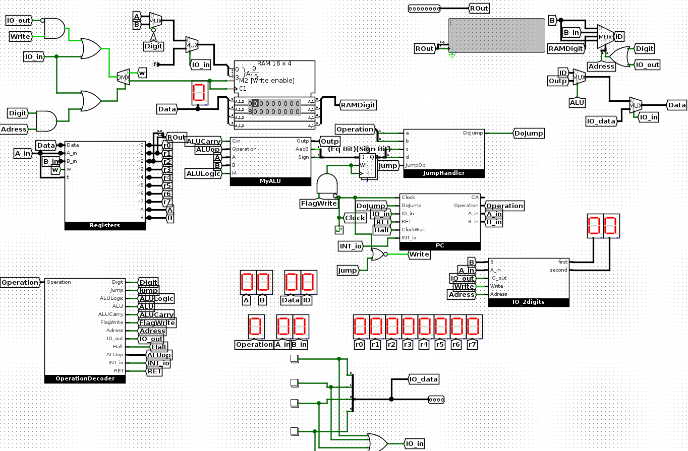
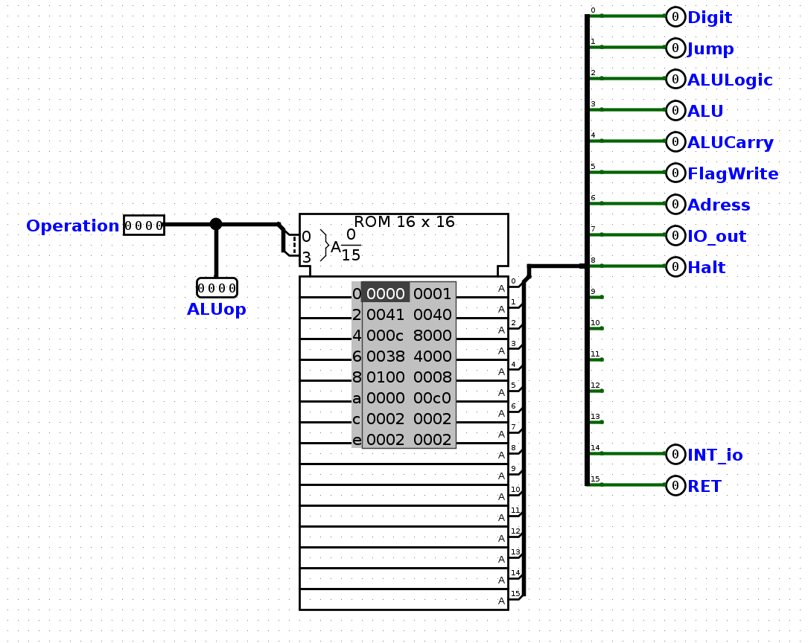
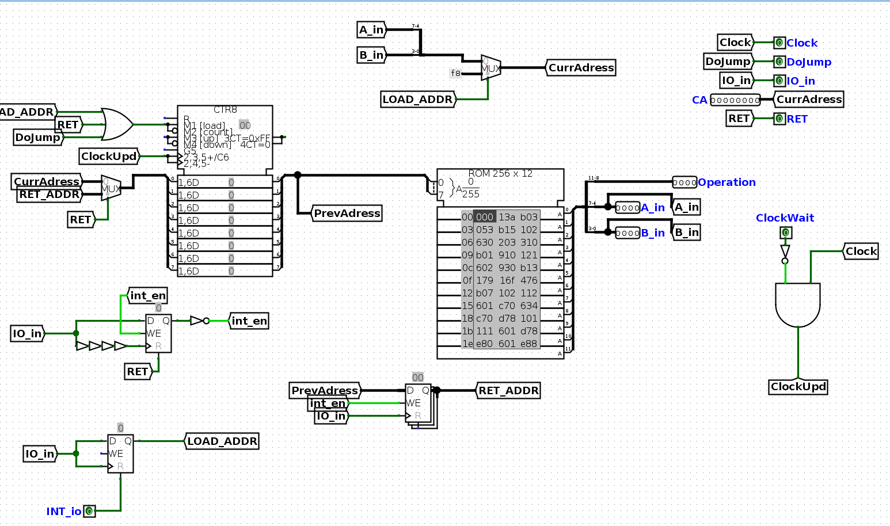
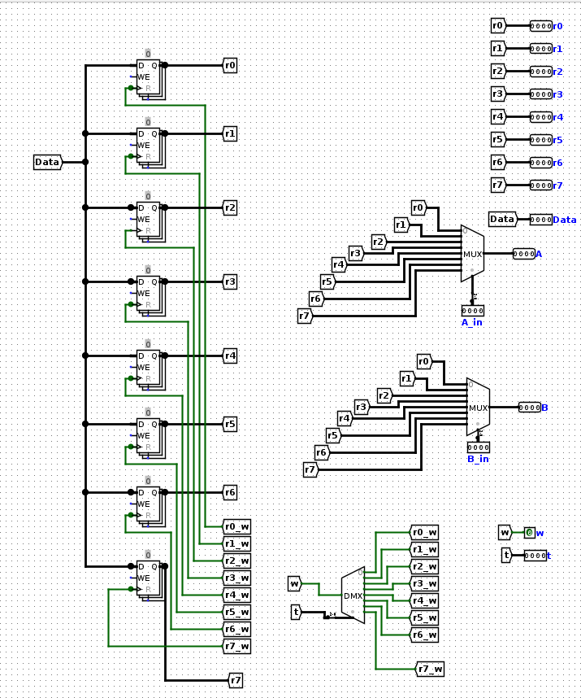

# Single-cycle nibble CPU

**1. Архітектура**
* Інструкції зберігаються в ROM і займають 12 біт в кожній комірці: 4 біти - код операції, решта операдни (по 4 біти під кожен). Комірок в ROM 256.
* Процесор має 8 4-бітних регістрів загального використання та 1 регістр для зберігання прапорців. Для зберігання даних використовується 4*16 RAM.
* Для виконання арифметичних та логічних операцій використовується 4-бітний ALU.
* Для послідовного виконання інструкцій використовується 8 бітний лічильник, операції умовних переходів виконуються, записуючи адресу потрібної іструкції ROM в лічильник.
Далі наведене схема процесора в Logisim:

**2. Логіка**
Процесор здійснює ту чи іншу операцію за допомогою контрольних бітів:
* Digit 
* Jump (для операцій безумовного переходу)
* Alu (для операцій, які використовують Alu)
* AluLogic (для логічних операцій Alu)
* AluCarry (ставить cin Alu на одиничку, в даному процесорі використовується тільки для операції SUB)
* FlagWright (біт запису в регістр флагів прапорець, в даному процесорі використовується для операції SUB)
* Adress (для операцій, які здійснюються з використанням даних з RAM або запису у пристрої периферії)
* IO_out (прапорець запису даних у пристрій периферії)
* Halt (прапорець зупинки зчитування інструкцій)
* INT_io (прапорець повідомлення про інтерапт)
* RET (прапорець повернення на комірку ROM, під час якої сталось переривання)
* Write (прапорець запису в регістр чи RAM)
Ці біти визначаються за допомогою декодера коду операції:

Далі табличка позначень різних операцій (r1, r2 - any register, immed - числове значення):

Operation              | Mnemonic                                                                                                                                                                                                                                                                                                                                       | Description
------------------------ | --------------------------------------------------------------------------------------------------------------------------------------------------------------------------------------------------------------------------------------------------------------------------------------------------------------------------------------------- | ---------
**0000 #0**            | mvr r1, r2 | скопіювати вміст r2 в r1
**0001 #1**            | mvd r1, immed | записати в регістр r1 immediate значення
**0010 #2**            | mva r1, r2 | записати в комірку пам'яті RAM значення, що знаходиться в r2 (адреса(порядковий номер) комірки знаходиться в r1)
**0011 #3**            | mvf r1, r2 | записати в регістр r1 значення, яке знаходиться в комірці RAM за адресою(порядковий номер), що знаходиться в регістрі r2
**0100 #4**            | nand r1, r2 | записати в r1 - r1 nand r2
**0101 #5**            | ret | повернутись у місце в РОМі, коли стався інтерапт
**0110 #6**            | sub r1, r2 | записати в r1 різницю r1 - r2, також це використовується як порівняння r2 та r1 (записуються прапорці в регістр флагів)
**0111 #7**            | io_int | interrupt вводу з клавіатури
**1000 #8**            | halt | Припинити зчитування команд
**1001 #9**            | add r1, r2 | записати в r1 суму r1 + r2
**1011 #b**            | iop immed, r1 | immed - адреса пристрою, r2 - регістр з даними
**1100 #c**            | jeq immed | перейти на комірку пам'яті за адресою immed в ROM, якщо прапорець рівності дорівнює 1, immed - 8 бітне число
**1101 #d**            | jls immed | перейти на комірку пам'яті за адресою immed в ROM, якщо прапорець знаку дорівнює 1, immed - 8 бітне число
**1110 #e**            | jle immed | перейти на комірку пам'яті за адресою immed в ROM, якщо прапорець знаку або рівності дорівнює 1, immed - 8 бітне число
**1111 #f**            | jne immed | перейти на комірку пам'яті за адресою immed в ROM, якщо прапорець рівності дорівнює 0, immed - 8 бітне число |

**Ремарки:**
* Кількість операцій може бути 16, тому, можливо, будуть реалізовані ще операції (наприклад інший вид переривань)
* В переліку операцій немає безумовного переходу, адже це можна зробити таким чином sub r1, r1; jeq immed
* Процесор має тільки 1 логічну операцію nand, адже вона робить систему повною.
* Регістр прапорець 2-бітний, він зберігає  біт рівності та біт знаку. Якщо ми зробимо sub r1, r2 і біт знаку буде дорівнювати 1, це означатимо що r1 < r2
* При зміні значення тактового генератора з 0 до 1 виконується операція, але нічого не записується (тобто біт Write = 0), а записується при переході з 1 на 0
* Джампи записуються в ROM наступним чином j<type> HEX

**3.PC**

Схема, як реалізований перехід однієї іструкції на іншу. Всі іструкції збережені в ROM. Clock - тактовий генератор. При зміні його значення з 0 на 1 виконується перехід на наступну іструкцію. A_in та B_in операнди, що можуть містити порядковий номер регістра або immed значення. Operation - код операції. CurrAdress - це адреса комірки пам'яті в ROM, використовується для умовних переходів. Якщо перші два біти коду операції - це 1 та котрольний біт DoJump = 1 (тобто виконується умова переходу), то значення A_inB_in (a1a2a3a4b1b2b3b4 - 8-bit) записується в лічильник.

**4. Registers**

Схема регістрів: to - адреса регістру, в який потрібно записати дані data, w - контрольний біт, який визначає чи записувати чи не записувати, A_in - адреса регістру A, B_in - адреса регістру B, за допомогою цих адрес визначення з яких регістрів давати дані на вихід.

**6. Мікросхеми**

Для побудови цього процесору використовувались такі мікросхеми:

* RAM - 74F189 64-Bit Random Access Memory with 3-STATE Outputs
* ROM x2- AT28C256 256K (32K x 8) Paged CMOS E^2PROM
* ALU - SN74LS181 ARITHMETIC LOGIC UNITS/FUNCTION GENERATORS
* Counter - SN74HC193 4-bit Synchronous Up/Down Counter (Dual clock with Clear)
* D-Trigger х9 - SN74LS173A 4-BIT D-TYPE REGISTERSWITH 3-STATE OUTPUTS
* Багато логічних мікросхем та мультиплексорів із серії 7400

**7. Файли**

*  [new_CPU.circ](LastVersion/new_CPU.circ) - головна схема процесора
*  [general_teset](LastVersion/general_test) - програма тестування всіх наявних можливостей процесору

**План роботи**

1. Проєктування схеми у програмі Proteus для створення друкованої плати в майбутньому.
* Перенесення логічної схеми у програму Prometeus
* Розведення схеми.
* Друк плати.
