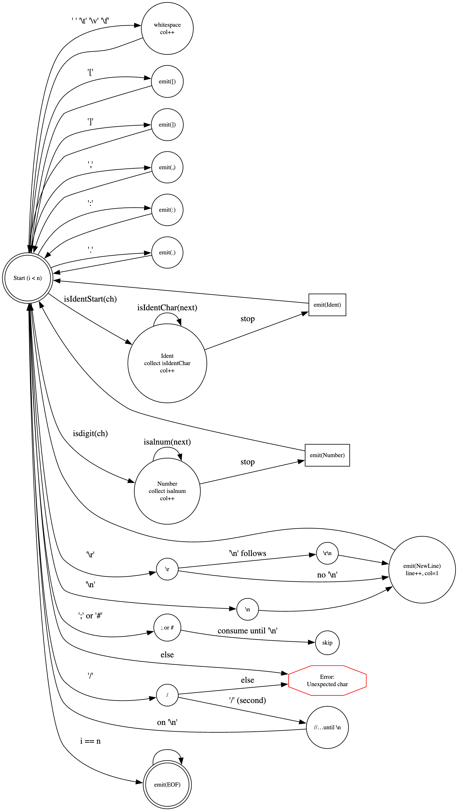

# DOCUMENTATION

# ASM Structures

## Operand Types

| OperandType    | Explanation                                | Example                       | Machine code (Big Endian)             |
|----------------|--------------------------------------------|-------------------------------|---------------------------------------|
| **None**       | Інструкція без аргументів                  | `nop`, `ret`, `hlt`           | Тільки 1 байт опкоду                  |
| **Reg**        | 8-бітний регістр                           | `add ac`, `mov xh, ac`        | Опкод визначається регістрами         |
| **Imm8**       | 8-бітне безпосереднє значення              | `ldi ac, 0x12`                | 1 байт значення після опкоду          |
| **Imm16**      | 16-бітне безпосереднє значення (адреса)    | `jmp 0x1234`                  | 2 байти у Big Endian (`12 34`)        |
| **Label**      | Мітка, що посилається на адресу коду/даних | `jmp main`                    | Як `Imm16`, але через релокацію       |
| **MemAbs16**   | Абсолютна адресація через пам'ять          | `ld ac, [0x1234]`             | 2 байти адреси у Big Endian (`12 34`) |
| **MemAtReg16** | Непряма адресація через 16-бітний регістр  | `ld ac, [X]`, `st [Y], ac`    | Опкод кодує вибір пари (X/Y/Z/SP/ADR) |
| **SP**         | Використання стекового покажчика           | `push ac`, `pop ac`           | Спеціальний режим доступу             |
| **PC**         | Лічильник команд                           | `jmp pc` (якщо підтримується) | Спеціальний режим                     |

> **Endianness:** усі 16-бітні значення у машинному коді зберігаються у **Big Endian** — спочатку **старший**, потім **молодший** байт (`HI → LO`).

---

## Registers

| Name    | Type   | Description                                                                              |
|---------|--------|------------------------------------------------------------------------------------------|
| **AC**  | 8-bit  | Основний акумулятор (ALU), молодший байт пари **X**                                      |
| **XH**  | 8-bit  | Старший байт регістра **X**                                                              |
| **YH**  | 8-bit  | Старший байт регістра **Y**                                                              |
| **YL**  | 8-bit  | Молодший байт регістра **Y**                                                             |
| **ZH**  | 8-bit  | Старший байт регістра **Z**                                                              |
| **ZL**  | 8-bit  | Молодший байт регістра **Z**                                                             |
| **FR**  | 3-bit  | Регістр прапорів: **Sign (S)**,**NotCarry (C)**, **Zero (Z)** NotCarry – інвертований    |
| **IR**  | 8-bit  | Instruction Register (зберігає поточний опкод)                                           |
| **X**   | 16-bit | Об'єднання **(XH:AC)** — використовується як 16-бітний адресний або арифметичний регістр |
| **Y**   | 16-bit | Об'єднання **(YH:YL)** — 16-бітний покажчик                                              |
| **Z**   | 16-bit | Об'єднання **(ZH:ZL)** — 16-бітний покажчик                                              |
| **SP**  | 16-bit | Stack Pointer — лічить **вгору/вниз** залежно від операції                               |
| **PC**  | 16-bit | Program Counter — завжди рахує **вгору**                                                 |
| **ADR** | 16-bit | Address Register — завжди також пише адресу в пам’ять                                    |
| **ARG** | 16-bit | Argument Register — тимчасовий регістр для збереження адрес або аргументів               |

---

# Symbol Table

## Purpose

**Symbol Table** — це таблиця, у якій асемблер зберігає всі **імена, що з’являються у програмі**:

* мітки (`main:`, `loop:`)
* імена змінних у секціях `.data`, `.bss`
* зовнішні або глобальні символи (`.globl func`, `extern printf`)

## Structure of symbol record

| Field     | Desc                                                                        |
|-----------|-----------------------------------------------------------------------------|
| `name`    | Ім’я символу (`"main"`, `"var1"`, `"printf"`)                               |
| `section` | Секція, де визначено символ (`.text`, `.data`, `.bss`, або `None`)          |
| `value`   | Адреса (offset у байтах) всередині секції                                   |
| `bind`    | Видимість: `Local`, `Global`, або `Weak`                                    |
| `defined` | Чи символ уже має адресу (`true` — визначений, `false` — тільки оголошений) |

## Symbol Life Cycle

### Pass1

Асемблер читає вихідний код і **будує таблицю символів**.

#### Якщо зустрічає мітку

```asm
main:
```

Додає або оновлює символ:

```
define("main", SectionType::Text, current_offset, Local)
```

#### Якщо директива `.globl foo`

Оголошує символ як глобальний, але `defined = false`.

#### Якщо зустрічає посилання на невідомий символ

```asm
jmp func
```

Створює запис `declare("func")` без визначення — щоб пізніше його знайти.

### Pass2

Асемблер формує машинний код.

* Якщо **символ визначений**, бере його адресу (`value`) і вставляє у код.
* Якщо **ще не визначений**, створює **релокаційний запис (RelocEntry)**, щоб лінкер пізніше підставив адресу.

## Example

```asm
.text
main:
    ldi z, func
    jmpx

func:
    nop
```

### Pass1

| name | section | value  | bind  | defined |
|------|---------|--------|-------|---------|
| main | .text   | 0x0000 | Local | true    |
| func | .text   | 0x0004 | Local | true    |

### Pass2

`ldi z, func` → знаходить `func` (визначений у `.text` з адресою `0x0004`)
→ асемблер вставляє `0x0004` у машинний код (`00 04`, Big Endian).

## Example with undefined symbol

```asm
.text
main:
    ldi y, msg
    jmp print

.data
msg:
    .ascii "Hello"

.globl print
```

### Pass1

| name  | section | value  | bind   | defined |
|-------|---------|--------|--------|---------|
| main  | .text   | 0x0000 | Local  | true    |
| msg   | .data   | 0x0000 | Local  | true    |
| print | None    | 0x0000 | Global | false   |

### Pass2

* `ldi y, msg` → `msg` визначений, адреса вставляється напряму.
* `jmp print` → `print` ще не визначений, створюється **релокація**:

```
reloc:
  offset = 0x0003      ; байт, де треба вставити адресу
  symbol = "print"
  type = ABS16
```

Коли `.o` файл зв’яжеться з іншим, де `print` визначений — **лінкер** підставить справжню адресу.

## Error Types

| Error                       | When                                        |
|-----------------------------|---------------------------------------------|
| `redefinition of symbol`    | символ з таким іменем уже визначений        |
| `undefined symbol`          | після Pass2 символ не знайдений і не Global |
| `invalid section reference` | посилання на секцію, якої не існує          |

## Example with `ldi` and `.text`

```asm
.text
main:
    ldi z, label
    jmpx

label:
    nop
```

Це **нормально**: `ldi` просто завантажує адресу `label` (наприклад, `0x0004`) у регістр `Z`, а `jmpx` виконує стрибок туди. `.text` — така ж секція з валідними адресами.


# Object File and Relocation System

## Overview

The **Object File** is an intermediate binary format generated by the assembler and consumed by the linker. It contains:

* Encoded sections of machine code and data.
* A list of symbols (labels, globals, etc.).
* Relocation entries that describe how to adjust addresses during linking.

This system allows the assembler and linker to work independently: the assembler doesn't need to know final memory addresses — it only marks where they should be patched.

---

## Object File Structure

Each object file is composed of three main tables:

| Component       | Description                                                                 |
|-----------------|-----------------------------------------------------------------------------|
| **Sections**    | Contain raw bytes of code or data (e.g., `.text`, `.data`, `.bss`).         |
| **Symbols**     | Contain all defined and referenced names with their addresses and bindings. |
| **Relocations** | Contain all positions where the linker must patch addresses.                |

### SectionDescription

```cpp
struct SectionDescription {
    std::string name;     // ".text", ".data", ".bss"
    uint8_t flags{0};     // 1=EXEC, 2=WRITE, 4=READ
    uint8_t align{1};     // alignment (1,2,4,...)
    std::vector<uint8_t> data; // raw bytes for .text/.data
    uint32_t bss_size{0}; // size of uninitialized section
};
```

#### Fields Explained

* **name** — name of the section.
* **flags** — section permissions (EXEC, WRITE, READ). Bitwise encoded.
* **align** — memory alignment for the section (must be a power of 2).
* **data** — machine code or initialized data.
* **bss_size** — memory size reserved for uninitialized data (.bss).

#### Example

| Section | Flags          | Align | Description                |
|---------|----------------|-------|----------------------------|
| `.text` | EXEC (1)       | 1     | Code section, executable   |
| `.data` | WRITE+READ (6) | 2     | Initialized data           |
| `.bss`  | WRITE+READ (6) | 2     | Zero-initialized variables |

---

### SymbolDescription

```cpp
struct SymbolDescription {
    std::string name;    // symbol name
    int32_t section_index; // section index, -1 = UNDEF
    uint32_t value;      // offset within section
    uint8_t bind;        // 0=Local, 1=Global, 2=Weak
};
```

#### Fields Explained

* **name** — symbol identifier (e.g., `main`, `msg`).
* **section_index** — section this symbol belongs to (`-1` means undefined).
* **value** — offset from the start of the section.
* **bind** — visibility and linkage type.

#### Usage

* **Local** symbols are visible only inside the same object file.
* **Global** symbols are visible to other object files.
* **Weak** symbols can be overridden by stronger ones.

---

## Relocation System

When an instruction refers to a label or variable whose address is not yet known, the assembler cannot directly encode the address. Instead, it generates a **RelocEntry** that describes where and how to patch the value once the final layout is known.

### RelocEntry

```cpp
struct RelocEntry {
    uint32_t section_index; // section where the relocation applies
    uint32_t offset;        // byte offset within the section
    RelocType type;         // type of relocation (e.g., ABS16)
    uint32_t symbol_index;  // index of the referenced symbol in the symbol table
    int32_t addend{0};      // additional constant offset
};
```

#### Fields Explained

| Field             | Meaning                                                           |
|-------------------|-------------------------------------------------------------------|
| **section_index** | In which section to apply the relocation (e.g., .text).           |
| **offset**        | The exact byte position inside that section that must be patched. |
| **type**          | Defines how to apply relocation (e.g., absolute 16-bit address).  |
| **symbol_index**  | Points to the symbol whose address should be inserted.            |
| **addend**        | Extra constant added to the symbol's address (for `label + N`).   |

#### RelocType

| Name    | Meaning                                              |
|---------|------------------------------------------------------|
| `ABS16` | Absolute 16-bit address, stored in Big Endian order. |

---

### Example Workflow

```asm
.text
main:
    ldi z, msg   ; load address of msg into Z
    jmpx         ; jump to Z

data:
msg:
    .ascii "Hello"
```

#### Pass1

* Defines `main` and `msg` in `.text` and `.data` sections.

#### Pass2

* Encodes `ldi z, msg` → opcode + placeholder for address.
* Since `msg` is known (in `.data`), its offset is inserted.
* If `msg` were in another object, assembler would instead add a relocation:

```cpp
RelocEntry {
    section_index = 0,     // .text
    offset = 2,            // where to patch
    type = RelocType::ABS16,
    symbol_index = 1,      // msg
    addend = 0
};
```

#### Linking

* The linker loads all `.o` files, merges sections.
* It replaces every relocation with the final absolute address:

  ```
  final_value = symbol_address + addend
  ```

  and writes it at `offset` inside the corresponding section.

---

# Lexer

## Purpose

Лексер — це перший етап роботи асемблера.
Він читає вихідний текст програми (`.asm`) і перетворює його у **послідовність токенів** — базових одиниць синтаксису (імена, числа, дужки, коми, тощо).

Кожен токен містить:

* **тип** (`Ident`, `Number`, `Comma`, `Dot`, …),
* **текстове значення** (наприклад `"ldi"` або `"0x42"`),
* **позицію у файлі** (рядок і стовпчик для зручного виведення помилок).

---

## Algorithm

Лексер проходить текст посимвольно зліва направо,
веде лічильники **рядка** і **колонки**, і будує токени за певними правилами.

1. **Пропускає порожні символи** — пробіли, табуляцію, вертикальні/форматні пробіли.
2. **Розпізнає коментарі**:

  * `;` або `#` — до кінця рядка;
  * `//` — також коментар до кінця рядка.
    Коментарі не потрапляють у потік токенів.
3. **Фіксує переходи рядка** (`\n`, `\r`, `\r\n`) — створює токен `NewLine`,
   оновлює `line++`, `col = 1`.
4. **Розпізнає розділові символи**:

   ```
   [ ] , : .
   ```

   — кожен стає окремим токеном (`LBracket`, `RBracket`, `Comma`, `Colon`, `Dot`).
5. **Ідентифікатори** — послідовність, що починається з літери або `_`,
   далі можуть бути літери, цифри або `_`.
   Формує токен `Ident`.
6. **Числа** — якщо перший символ — цифра, зчитує всі наступні **цифри або літери**,
   формуючи токен `Number`.
   Тип системи числення (0x..., 0b...) визначається пізніше у `parseNumber`.
7. Якщо зустрічає **невідомий символ** — кидає помилку `util::Error("Unexpected character in input")`.
8. Після завершення додає токен `Eof` — кінець файлу.

---

## FSM



На зображенні нижче показано **спрощену модель кінцевого автомата (Finite State Machine)**,
який відображає переходи між станами лексера.

* `Start` — початковий стан;
* `NewLine` — обробка переходів рядків;
* `WS` — пропуск пробільних символів;
* `Ident`, `Number` — накопичення тексту токенів;
* `Slash`, `LineComment`, `SemiHash` — обробка коментарів;
* `Emit*` — формування готового токена;
* `Eof` — завершення аналізу;
* `Error` — некоректний символ.

> Кожна стрілка позначає перевірку символу і перехід у новий стан.
> Коли лексер знаходить токен, він “викидає” його у список результатів і повертається до стану `Start`.

---

## Example

Вхідний код:

```asm
; comment
ldi x, 0x42
add-xh
```

Після `lex()` отримаємо токени:

| Тип токена | Текст    | Рядок | Колонка |
|------------|----------|-------|---------|
| `NewLine`  |          | 1     | 1       |
| `Ident`    | `ldi`    | 2     | 1       |
| `Ident`    | `x`      | 2     | 5       |
| `Comma`    | `,`      | 2     | 6       |
| `Number`   | `0x42`   | 2     | 8       |
| `NewLine`  |          | 2     | 12      |
| `Ident`    | `add-xh` | 3     | 1       |
| `Eof`      |          | 3     | 8       |

---
